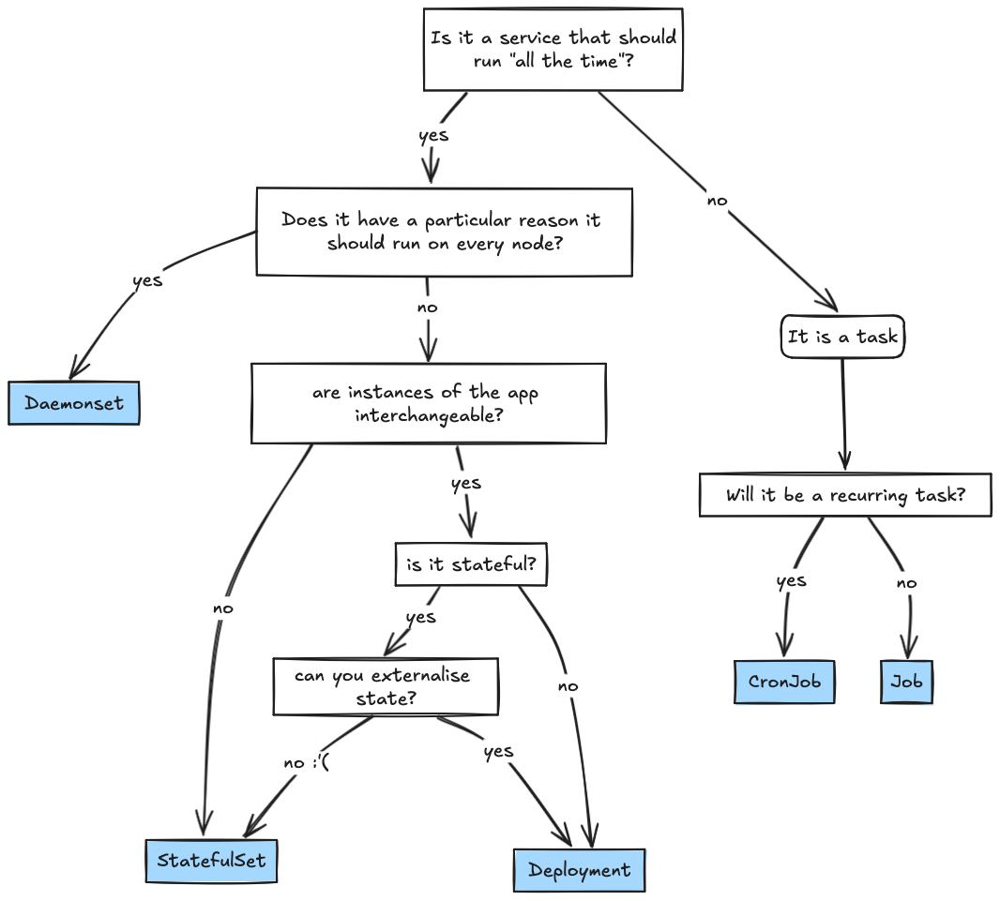

# GRWM: Get your kubernetes workload ready for production

In this piece, we will explore the key considerations for configuring a resilient workload and preparing it for production in Kubernetes. By asking ourselves the right questions, we can effectively leverage the orchestration features provided by Kubernetes to ensure our workload is well-configured and ready for deployment.

In a part two I'll step through configuring this for an example application.


## Workload Management

#### *How* should we run it?

It's important to understand the [workload mangement](https://kubernetes.io/docs/concepts/workloads/controllers/) options Kubernetes offers and selecting the appropriate controller for the service. What the workload itself actually does is a great starting point.

Most applications should run as [Deployments](https://kubernetes.io/docs/concepts/workloads/controllers/deployment/). To get the most out of the "self-healing" powers and scaleability of k8s you should do your best to externalise any application state and allow your application instances to be totally interchangeable. There may be some "pre work" to do that can help prepare the application itself for deployment - read about [The Twelve Factor App.](https://12factor.net/) 


Kubernetes does accommodate stateful workloads with [StatefulSets](https://kubernetes.io/docs/concepts/workloads/controllers/statefulset/) and [PersistentVolumes](https://kubernetes.io/docs/concepts/storage/persistent-volumes/). These can be used to leverage the ordinal pod numbers for workloads where the unique identity of the instance matters. 


Workloads that could be described as "tasks" will be suited to [CronJobs](https://kubernetes.io/docs/concepts/workloads/controllers/cron-jobs/) or [Jobs](https://kubernetes.io/docs/concepts/workloads/controllers/job/) which deserve their own post on configuring.

#### A quick dirty flowchart:


>Note: if you are *not* a cluster admin, disregard daemonSets in the flow-chart. Daemonsets run a pod on every node, specialised system workloads like network plugins are an example of a workload that must be run as a DaemonSet.

#### Scheduling

To get scheduled on an appropriate node by [kube-scheduler](https://kubernetes.io/docs/reference/command-line-tools-reference/kube-scheduler/) the workload should define what resources or other host requirements it needs.

- What are the application's resource requirements? This includes CPU, memory and ephemeral storage. What would appropriate [requests and limits](https://kubernetes.io/docs/concepts/configuration/manage-resources-containers/) be? Resource requests are used to appropriately schedule the workload on an accommodating node.
- Node requirements. To get scheduled on a particular type of node you have a number of levers available to you which are documented [here](https://kubernetes.io/docs/concepts/scheduling-eviction/assign-pod-node/).:
  - Are there specialised nodes available that this workload needs to use (high memory, or different architectures, need GPUs?)
  - Should the workload isolated from other workloads? 
  - OS?
- Is the workload "critical" or very high priority? Administrators may allow you to leverage [PriorityClasses](https://kubernetes.io/docs/concepts/scheduling-eviction/pod-priority-preemption/#priorityclass). 


#### Application Config

What does the application need with respect to configuration?
Your application probably needs some values that it requires to run as well as other environment particular configurations that differ between deployment environments - like where to reach an external service it calls and credentials. 

There are multiple ways to expose these values to workloads by leveraging the native Kubernetes objects. What do you need to pass in to your workload? We can achieve this with:

- [Secrets](https://kubernetes.io/docs/concepts/configuration/secret/)
  - For small sensitive data. For decoupling sensitive data from code. NOTE THAT THEY ARE STORED UNENCRYPTED IN ETCD. So often secrets are not used for *actually* sensitive data. Consider other secret management services that integrate with k8s here.
- [ConfigMaps](https://kubernetes.io/docs/concepts/configuration/configmap/)
  - For non-confidential data, defined in key-value pairs.
  - Great for things like nginx config file, or a set of configuration key pair values that you can mount as envVars for the application.

 Consume configuration objects:

 - You can [mount objects like ConfigMaps as Volumes for your container to consume.](https://kubernetes.io/docs/tasks/configure-pod-container/configure-pod-configmap/#populate-a-volume-with-data-stored-in-a-configmap)  

- [Environment Variables](https://kubernetes.io/docs/tasks/inject-data-application/define-environment-variable-container/) - You can set environment variables directly (which you could template) or by referencing an object like a Secret, ConfigMap or Volume

If there are some special actions that need to take place for configuration that for some reason can't be served by already existing objects, or there's a timing problem that the value for something can't be known until whenever - [Init Containers](https://kubernetes.io/docs/concepts/workloads/pods/init-containers/) could be leveraged to do the work of helping create the configuration for the "main" app and updating a shared volume for the pod (just as an example). Will discuss these in lifecycle management section.

Do go ahead and read the kubernetes [workload configuration best practices](https://kubernetes.io/docs/concepts/configuration/overview/#general-configuration-tips) 

#### workload lifecycle management

Workloads running in Kubernetes get their resilience from the constant control loops that maintain a desired state for a workload, there's a few configurations that are important for maintaining stability across things like upgrades to the underlying host nodes, making sure that on start-up the container only receives traffic when it is ready and others.

##### Start Up

Things to configure to make sure your application starts right and keeps going while it should.


If you application needs some special work done before it can begin, [init containers](https://kubernetes.io/docs/concepts/workloads/pods/init-containers/) are how you could ensure the application container(s) don't start until a number of conditions are met. You can (in v1.29) also use init containers to run a [Sidecar](https://kubernetes.io/docs/concepts/workloads/pods/sidecar-containers/#pod-sidecar-containers) by setting ```restartPolicy: Always```.

All containers should have Liveness, Readiness and Startup [probes](https://kubernetes.io/docs/tasks/configure-pod-container/configure-liveness-readiness-startup-probes/) configured as needed, and great care should be given to these. These probes are used by Kubelet to determine the health and status of a container to know if it is ready to receive traffic or failed and should be restarted. If misconfigured they can make deployments difficult or leave an unhealthy workload running without much feedback or worse, they're essential for production workloads so just do your due diligence.

##### Finish Up

Sometimes containers or nodes die and that's just "the cloud" things are ephemeral and that's fine and good, and you'll rely on having a highly available configuration to manage that, but hopefully most of the time your workloads stop it's because either:
- less traffic so you're scaling down the deployment through a Horizontal Pod Autoscaler
- kubernetes upgrades require draining the node so it can be upgraded
- cluster is scaling down to save money yay, so the node is being drained

For cases where there's more control over shut downs we can make sure they go as smooth as possible by setting appropriate ```terminationGracePeriodSeconds``` for the application container and we should use [Container Hooks](https://kubernetes.io/docs/concepts/containers/container-lifecycle-hooks/), particularly preStop hooks aid by giving us a way to closing any long running requests or connections and terminating our application gracefully.


##### Handle Change Smoothly

There's a bunch of deployment strategies that are popular and ways to implement them in k8s like blue-green or whatever but let's just look at the native things.

Make sure your objects will all behave "sanely" together while you deploy. Be mindful of if you configure a [Pod Disruption Budget](https://kubernetes.io/docs/tasks/run-application/configure-pdb/) for your workload it also suits you well for while you're rolling out a change to the deployment object. I've seen teams whose change was taking a very long time and they asked for help - their PDB had made their deployment's [RollingUpdate](https://kubernetes.io/docs/tasks/run-application/configure-pdb/) change go very slowly because they wanted an outrageous number of replicas and a very conservative disruption budget.


#### Being Reliable: High Availability, Fault Tolerance, Scaling etc.
- Run your workload with a high availability topology
- See scheduling and antiAffinities and other ways to do this
- run multiple replicas
- Configure a HPA appropriately
  - is your workload memory bound? cpu bound? maybe neither? maybe queue length you will need custom metrics to scale in that case. Find out what the good
- Consider VPA if appropriate

#### Be a good citizen

- resource limits
- let cronjobs fail nicely.


